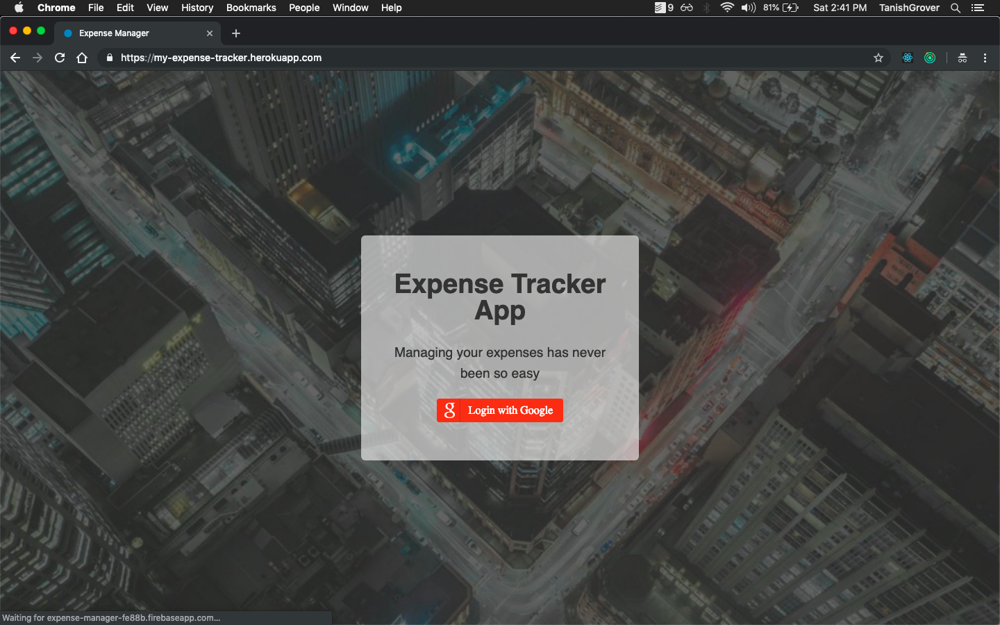
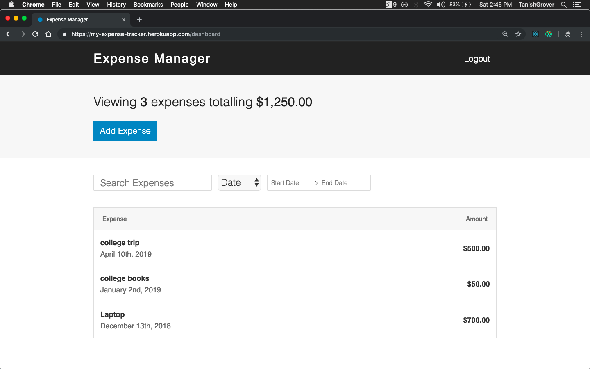
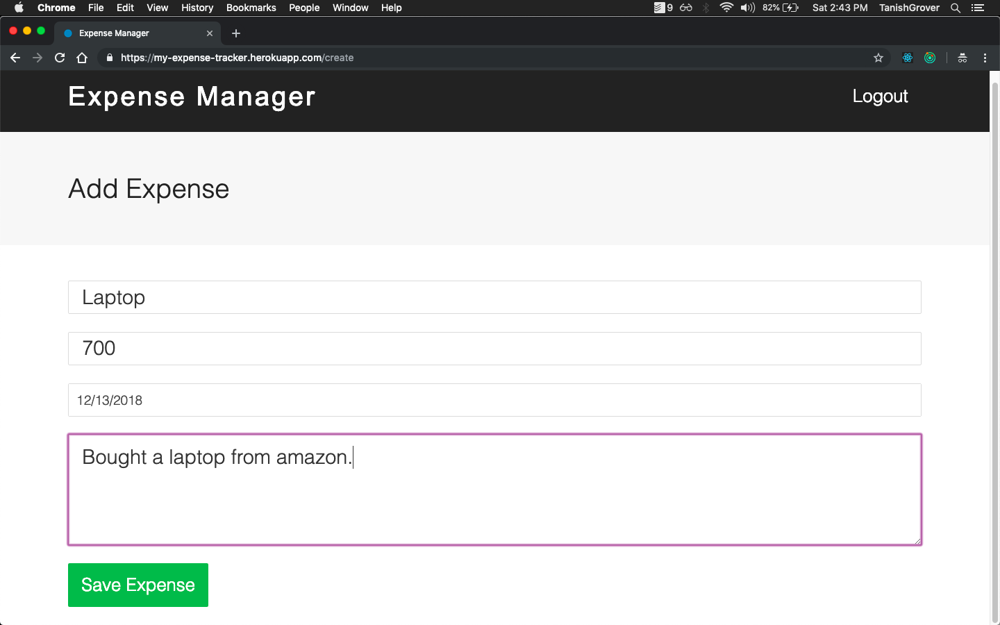
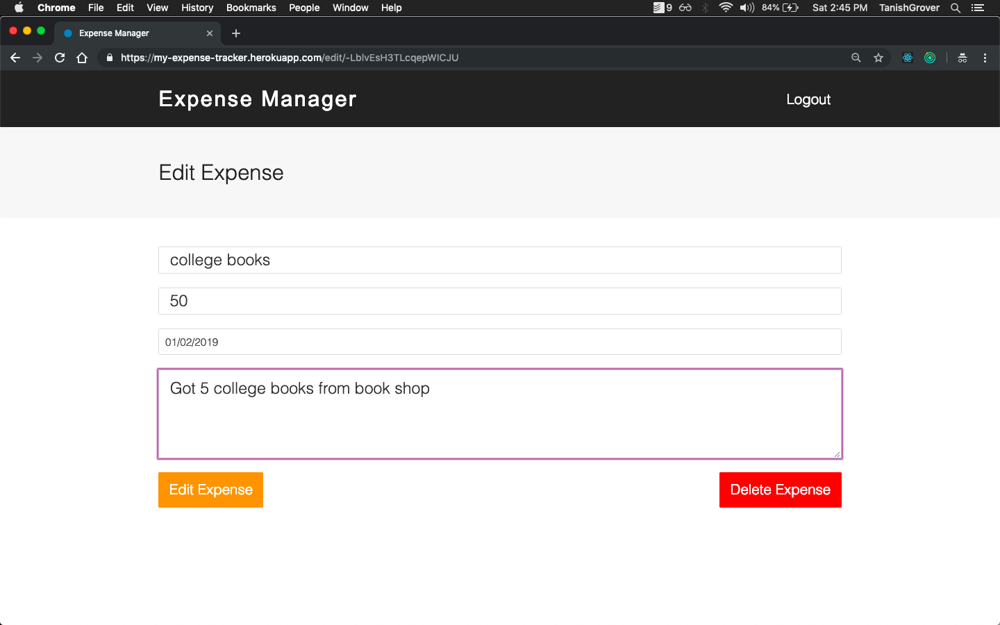
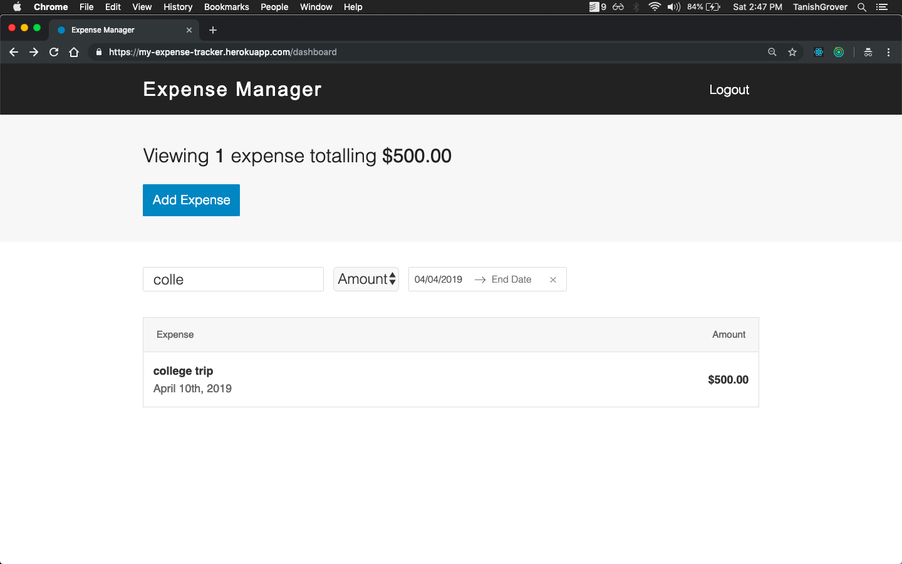

# Expense-Manager
A web app to help users keep track and manage their daily expenses. The users can add expenses and provide the date, the name and an optional short description of the expense. The users can then filter through the expenses on basis of name, sort according to date or amount and also search for expenses made within a specified period of time. Try it [here!](https://my-expense-tracker.herokuapp.com/)
Made using ReactJS and Firebase.

## Getting Started
- Create a .env.development file with the following contents
```
FIREBASE_API_KEY=
FIREBASE_AUTH_DOMAIN=
FIREBASE_DATABASE_URL=
FIREBASE_PROJECT_ID=
FIREBASE_STORAGE_BUCKET=
FIREBASE_MESSAGING_SENDER_ID=
```
``` 
npm install
npm run start
```

## Demo

##### Login using your google account


---

##### Expenses list


--- 

##### Adding an expense


---

##### Editing an expense


---

##### Filtering through expenses

